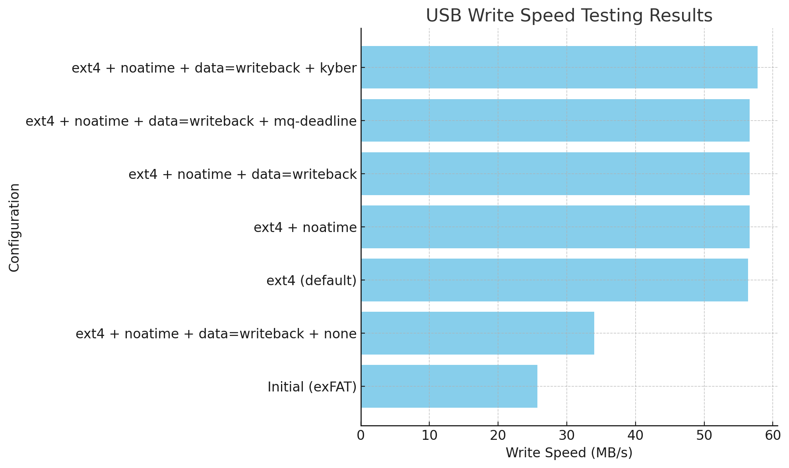

# USB Optimization Script

This script optimizes a USB drive's performance on Linux by applying several changes, including filesystem optimizations, I/O scheduler tuning, and persistent configurations. The script dynamically detects the connected USB drive and allows you to optimize it with minimal effort.



## Features

1. **Filesystem Check and Mount Options**:
   - Detects the filesystem type of the USB drive.
   - Suggests formatting to `ext4` (but does not execute it directly).
   - Mounts the drive with performance options (`noatime`, `data=writeback`).

2. **I/O Scheduler Tuning**:
   - Tests different I/O schedulers (`mq-deadline`, `kyber`, `none`) to find the best performance.
   - Allows you to persist the selected scheduler via `udev` rules.

3. **System-Level Optimizations**:
   - Adjusts `sysctl` settings for better write performance.
   - Sets readahead size to optimize sequential I/O.

4. **Persistent Configuration**:
   - Adds mount options to `/etc/fstab` and scheduler settings to `/etc/udev/rules.d` for persistence.

## Test Results

The following tests were conducted to measure the impact of each optimization on USB write performance. Below is the summary of results from our testing process:

| Configuration                                   | Write Speed (MB/s) |
|-------------------------------------------------|---------------------|
| **Initial (exFAT)**                             | 25.7               |
| **ext4 (default)**                              | 56.4               |
| **ext4 + noatime**                              | 56.6               |
| **ext4 + noatime + data=writeback**             | 56.6               |
| **ext4 + noatime + data=writeback + mq-deadline** | 56.6               |
| **ext4 + noatime + data=writeback + kyber**     | 57.8               |
| **ext4 + noatime + data=writeback + none**      | 34.0               |
|-------------------------------------------------|---------------------|


For a visual representation, see the chart above.

## Example `dd` Outputs

### **Initial (exFAT)**
```bash
# dd if=/dev/zero of=./testfile bs=1M count=1024 oflag=direct
1024+0 records in
1024+0 records out
1073741824 bytes (1.1 GB, 1.0 GiB) copied, 41.7095 s, 25.7 MB/s
```

### **ext4 (default)**
```bash
# dd if=/dev/zero of=./testfile bs=1M count=1024 oflag=direct
1024+0 records in
1024+0 records out
1073741824 bytes (1.1 GB, 1.0 GiB) copied, 19.0428 s, 56.4 MB/s
```

### **ext4 + noatime**
```bash
# dd if=/dev/zero of=./testfile bs=1M count=1024 oflag=direct
1024+0 records in
1024+0 records out
1073741824 bytes (1.1 GB, 1.0 GiB) copied, 18.963 s, 56.6 MB/s
```

### **ext4 + noatime + data=writeback**
```bash
# dd if=/dev/zero of=./testfile bs=1M count=1024 oflag=direct
1024+0 records in
1024+0 records out
1073741824 bytes (1.1 GB, 1.0 GiB) copied, 18.963 s, 56.6 MB/s
```

### **ext4 + noatime + data=writeback + mq-deadline**
```bash
# dd if=/dev/zero of=./testfile bs=1M count=1024 oflag=direct
1024+0 records in
1024+0 records out
1073741824 bytes (1.1 GB, 1.0 GiB) copied, 18.963 s, 56.6 MB/s
```

### **ext4 + noatime + data=writeback + kyber**
```bash
# dd if=/dev/zero of=./testfile bs=1M count=1024 oflag=direct
1024+0 records in
1024+0 records out
1073741824 bytes (1.1 GB, 1.0 GiB) copied, 18.5675 s, 57.8 MB/s
```

### **ext4 + noatime + data=writeback + none**
```bash
# dd if=/dev/zero of=./testfile bs=1M count=1024 oflag=direct
1024+0 records in
1024+0 records out
1073741824 bytes (1.1 GB, 1.0 GiB) copied, 31.5595 s, 34.0 MB/s
```

## Usage

1. **Run the Script:**
   ```bash
   sudo ./optimize_usb.sh
   ```

2. **Follow Prompts:**
   - Select the USB device to optimize.
   - Confirm or skip various configurations, such as adding persistent settings.

3. **Benchmark the Results:**
   - Use the provided `dd` command to verify the changes.

## Notes

- The script does **not** format the USB drive directly. It provides the command to do so if needed.
- Ensure to back up your data before applying these optimizations, as some steps (e.g., reformatting) are destructive.
